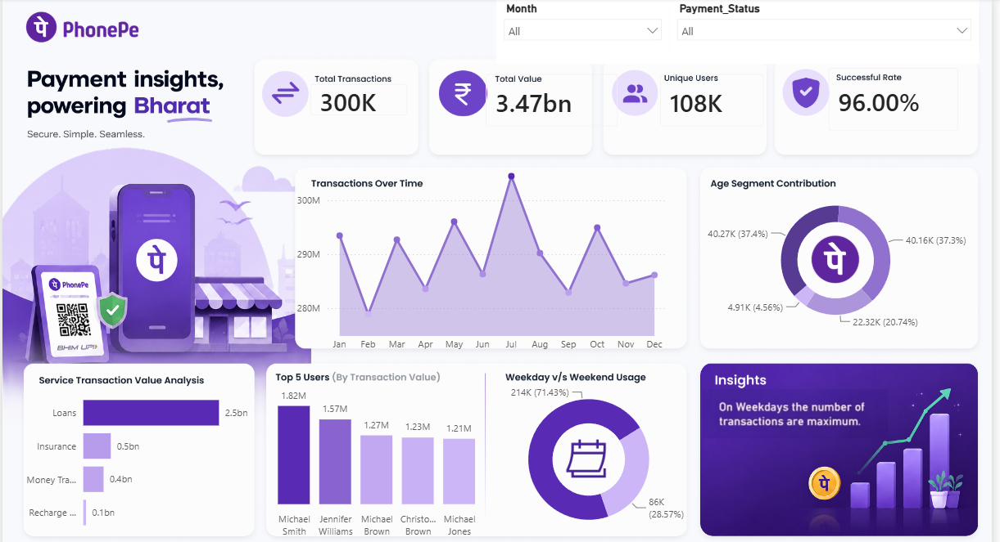

# 📊 PhonePe Transaction Analysis Dashboard \| Power BI



## 📌 Project Overview

This project is an end-to-end Business Intelligence dashboard developed
using **Power BI** to analyze PhonePe transaction and user data. The
dashboard provides interactive insights into transaction performance,
payment success rates, user growth, and service-wise analysis through
dynamic visualizations and KPIs.

The project demonstrates the complete BI workflow, including data
cleaning, data modeling, DAX calculations, dashboard design, and
business insight generation.

------------------------------------------------------------------------

## 🎯 Business Objective

The objective of this project is to transform raw PhonePe transaction
data into meaningful business insights that help answer questions such
as:

-   Which services generate the highest transaction value?
-   How many transactions are successful and failed?
-   How is transaction performance changing over time?
-   What is the month-over-month growth?
-   How many users are registered on the platform?
-   Which services require business attention?

------------------------------------------------------------------------

## 📂 Dataset

The project uses two datasets.

### Users Dataset

-   User ID
-   User Name
-   Age
-   Registration Date

### Transactions Dataset

-   Transaction ID
-   User ID
-   Transaction Date
-   Amount
-   Service
-   Service Type
-   Payment Status
-   Failure Reason

------------------------------------------------------------------------

## 🧹 Data Preparation

Data preparation was performed using **Power Query**.

### Data Cleaning

-   Checked column quality and data types
-   Removed duplicate records
-   Removed blank rows
-   Renamed columns
-   Replaced underscores in service names
-   Validated date columns
-   Verified column distribution and profiling

------------------------------------------------------------------------

## 🔗 Data Modeling

The project follows a relational data model.

-   Users → Transactions (One-to-Many)
-   Date Table → Transactions (One-to-Many)

A custom **Date Table** was created using DAX and marked as the official
date table for time intelligence calculations.

------------------------------------------------------------------------

## 📈 DAX Measures

-   Total Transaction Value
-   Total Transactions
-   Successful Transactions
-   Failed Transactions
-   Success Rate
-   Registered Users
-   Month-over-Month Transaction Growth
-   Month-over-Month User Growth

------------------------------------------------------------------------

## 📊 Dashboard Features

-   KPI Cards
-   Interactive Slicers
-   Bar Charts
-   Donut Charts
-   Line Charts
-   Dynamic Filtering
-   Conditional Formatting
-   Gradient Color Formatting
-   Month-over-Month Indicators
-   Responsive Dashboard Layout

------------------------------------------------------------------------

## 💡 Business Insights

-   Analyze transaction trends over time.
-   Compare successful and failed transactions.
-   Monitor user registration growth.
-   Identify high-performing services.
-   Track month-over-month business performance.
-   Explore transaction distribution through interactive visuals.

------------------------------------------------------------------------

## 🛠 Tools & Technologies

  -----------------------------------------------------------------------
  Category                      Technologies
  ----------------------------- -----------------------------------------
  BI Tool                       Power BI

  Data Transformation           Power Query

  Data Modeling                 Power BI Data Model

  Calculations                  DAX

  Dataset                       Microsoft Excel

  Visualization                 KPI Cards, Bar Charts, Donut Charts, Line
                                Charts, Slicers
  -----------------------------------------------------------------------

------------------------------------------------------------------------

## 📷 Dashboard Preview

### Dashboard Page 1


### Dashboard Page 2


------------------------------------------------------------------------

## 🚀 Project Workflow

``` text
Excel Dataset
        │
        ▼
Power Query
        │
        ▼
Data Cleaning
        │
        ▼
Data Modeling
        │
        ▼
Date Table (DAX)
        │
        ▼
Measures (DAX)
        │
        ▼
Interactive Dashboard
        │
        ▼
Business Insights
```

------------------------------------------------------------------------

## 🎯 Skills Demonstrated

-   Data Cleaning
-   Data Transformation
-   Data Modeling
-   DAX Calculations
-   KPI Development
-   Dashboard Design
-   Business Intelligence
-   Data Visualization
-   Analytical Thinking
-   Business Reporting

------------------------------------------------------------------------

## 📌 Repository Structure

``` text
PhonePe-Transaction-Analysis-PowerBI
│
├── Dashboard
│   └── PhonePe_Transaction_Analysis.pbix
│
├── Dataset
│   ├── All_Transactions.xlsx
│   └── All_Users.xlsx
│
├── Images
│   ├── Dashboard_Page1.png
│   ├── Dashboard_Page2.png
│   └── KPI_Cards.png
│
└── README.md
```

------------------------------------------------------------------------

## 📬 Contact

**Name:** Vinay Nuthanakalva

**LinkedIn:** *(Add your LinkedIn URL here)*

**GitHub:** *(Add your GitHub profile URL here)*

------------------------------------------------------------------------

⭐ If you found this project useful, feel free to star the repository.
